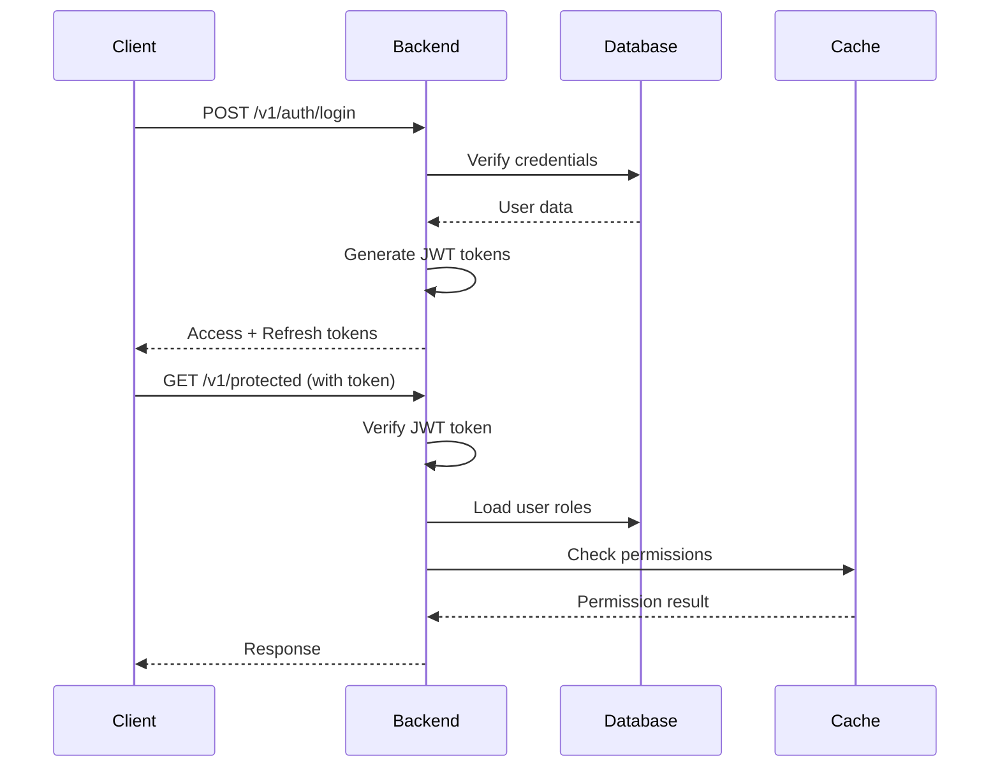
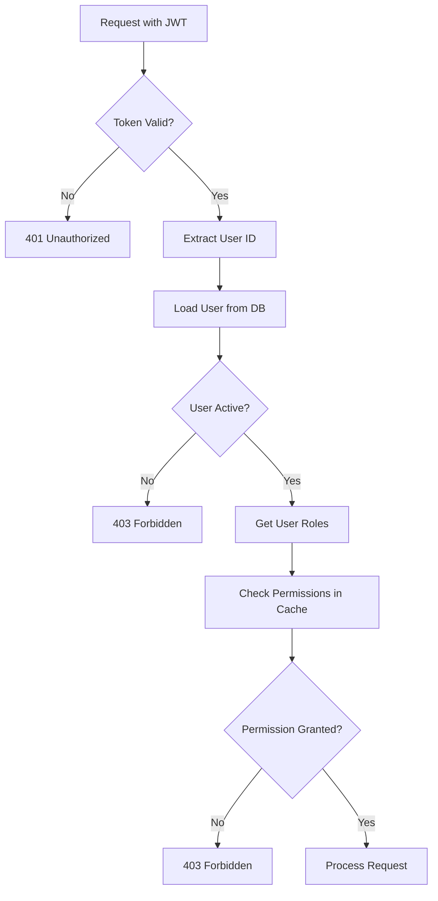

# Authentication Architecture

This document describes the authentication and authorization architecture of Resume Agent.

## Authentication Flow



## JWT Token Lifecycle

### Token Creation

1. User authenticates (login/register)
2. Backend validates credentials
3. Backend generates access token (15 min expiry)
4. Backend generates refresh token (30 day expiry)
5. Tokens returned to client

### Token Usage

1. Client includes access token in `Authorization` header
2. Backend validates token signature
3. Backend checks token expiration
4. Backend extracts user ID from token
5. Backend loads user from database

### Token Refresh

1. Access token expires
2. Client sends refresh token
3. Backend validates refresh token
4. Backend generates new access token
5. New access token returned to client

## Authorization Flow



## RBAC System Architecture

### Role-Permission Model

```
User ──many-to-many──> Role ──many-to-many──> Permission
```

### Permission Format

```
resource:action

Examples:
- user:read
- user:write
- user:delete
- post:read
- post:write
```

### Cache Structure

```python
{
    "role_permissions": {
        "admin": {"user:read", "user:write", "user:delete", ...},
        "user": {"user:read", "post:read", ...}
    },
    "all_permissions": {"user:read", "user:write", ...},
    "role_names": {"admin", "user", "moderator"},
    "default_roles": {"user"},
    "permission_to_roles": {
        "user:read": {"admin", "user"},
        "user:write": {"admin"}
    }
}
```

## Token Structure

### Access Token Payload

```json
{
  "sub": "user_id",
  "email": "user@example.com",
  "roles": ["user", "admin"],
  "type": "access",
  "iat": 1234567890,
  "exp": 1234568790
}
```

### Refresh Token Payload

```json
{
  "sub": "user_id",
  "email": "user@example.com",
  "type": "refresh",
  "iat": 1234567890,
  "exp": 1234567890
}
```

## Cache Invalidation

The RBAC cache automatically invalidates when:

1. Role is inserted/updated/deleted
2. Permission is inserted/updated/deleted
3. Role-permission relationship changes

Cache reloads on next access after invalidation.

## Security Considerations

### Token Security

- Tokens signed with HMAC-SHA256
- Separate secrets for access and refresh tokens
- Short-lived access tokens (15 minutes)
- Long-lived refresh tokens (30 days)

### Password Security

- Passwords hashed using secure algorithms
- Never stored in plain text
- Strong password requirements (client-side)

### Permission Checks

- Always checked server-side
- Never trust client-side permissions
- Cache provides fast O(1) lookups
- Database fallback if cache unavailable

## Related Documentation

- [Auth System Deep Dive](../../backend/docs/auth-system.md) - Technical details
- [Authentication Guide](../guides/authentication.md) - User guide
- [RBAC Setup Guide](../guides/rbac-setup.md) - Setup instructions
- [Caching Strategy](caching.md) - Cache implementation

