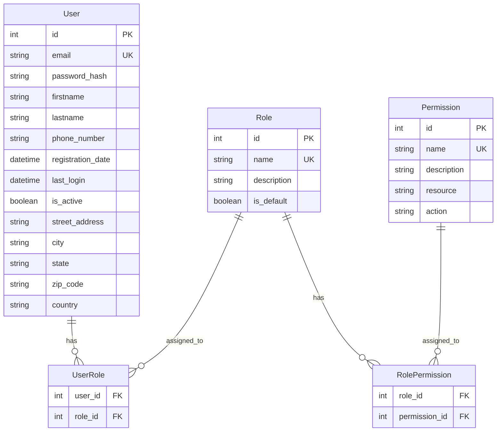

# Database Schema

This document describes the database schema for Resume Agent.

## Entity Relationship Diagram



## Tables

### User Table

Stores user account information.

| Column | Type | Constraints | Description |
|--------|------|-------------|-------------|
| id | INTEGER | PRIMARY KEY | User ID |
| email | VARCHAR(255) | UNIQUE, NOT NULL | User email address |
| password_hash | VARCHAR(255) | NOT NULL | Hashed password |
| firstname | VARCHAR(100) | NOT NULL | First name |
| lastname | VARCHAR(100) | NOT NULL | Last name |
| phone_number | VARCHAR(20) | NULL | Phone number |
| registration_date | TIMESTAMP | NOT NULL | Registration timestamp |
| last_login | TIMESTAMP | NULL | Last login timestamp |
| is_active | BOOLEAN | NOT NULL, DEFAULT true | Account active status |
| street_address | VARCHAR(255) | NULL | Street address |
| city | VARCHAR(100) | NULL | City |
| state | VARCHAR(100) | NULL | State/Province |
| zip_code | VARCHAR(20) | NULL | ZIP/Postal code |
| country | VARCHAR(100) | NULL | Country |

### Role Table

Stores roles that can be assigned to users.

| Column | Type | Constraints | Description |
|--------|------|-------------|-------------|
| id | INTEGER | PRIMARY KEY | Role ID |
| name | VARCHAR(50) | UNIQUE, NOT NULL | Role name |
| description | VARCHAR(255) | NULL | Role description |
| is_default | BOOLEAN | NOT NULL, DEFAULT false | Default role flag |

### Permission Table

Stores permissions that can be assigned to roles.

| Column | Type | Constraints | Description |
|--------|------|-------------|-------------|
| id | INTEGER | PRIMARY KEY | Permission ID |
| name | VARCHAR(100) | UNIQUE, NOT NULL | Permission name |
| description | VARCHAR(255) | NULL | Permission description |
| resource | VARCHAR(50) | NOT NULL | Resource name (e.g., "user") |
| action | VARCHAR(50) | NOT NULL | Action name (e.g., "read") |

### UserRole Junction Table

Many-to-many relationship between users and roles.

| Column | Type | Constraints | Description |
|--------|------|-------------|-------------|
| user_id | INTEGER | PRIMARY KEY, FK | User ID |
| role_id | INTEGER | PRIMARY KEY, FK | Role ID |

**Foreign Keys:**
- `user_id` → `user.id` (ON DELETE CASCADE)
- `role_id` → `role.id` (ON DELETE CASCADE)

### RolePermission Junction Table

Many-to-many relationship between roles and permissions.

| Column | Type | Constraints | Description |
|--------|------|-------------|-------------|
| role_id | INTEGER | PRIMARY KEY, FK | Role ID |
| permission_id | INTEGER | PRIMARY KEY, FK | Permission ID |

**Foreign Keys:**
- `role_id` → `role.id` (ON DELETE CASCADE)
- `permission_id` → `permission.id` (ON DELETE CASCADE)

## Relationships

### User ↔ Role

- **Type**: Many-to-many
- **Junction Table**: `user_role`
- **Description**: Users can have multiple roles, roles can be assigned to multiple users

### Role ↔ Permission

- **Type**: Many-to-many
- **Junction Table**: `role_permission`
- **Description**: Roles can have multiple permissions, permissions can be assigned to multiple roles

## Indexes

### User Table

- `email`: Unique index for fast email lookups
- `id`: Primary key index

### Role Table

- `name`: Unique index for fast role name lookups
- `id`: Primary key index

### Permission Table

- `name`: Unique index for fast permission name lookups
- `id`: Primary key index

## Data Integrity

### Cascading Deletes

- Deleting a user removes all `user_role` entries
- Deleting a role removes all `user_role` and `role_permission` entries
- Deleting a permission removes all `role_permission` entries

### Constraints

- Email addresses must be unique
- Role names must be unique
- Permission names must be unique
- Foreign key constraints ensure referential integrity

## Common Queries

### Get User with Roles

```sql
SELECT u.*, r.name as role_name
FROM user u
LEFT JOIN user_role ur ON u.id = ur.user_id
LEFT JOIN role r ON ur.role_id = r.id
WHERE u.id = ?;
```

### Get Role with Permissions

```sql
SELECT r.*, p.name as permission_name, p.resource, p.action
FROM role r
LEFT JOIN role_permission rp ON r.id = rp.role_id
LEFT JOIN permission p ON rp.permission_id = p.id
WHERE r.id = ?;
```

### Get User Permissions

```sql
SELECT DISTINCT p.resource, p.action
FROM user u
JOIN user_role ur ON u.id = ur.user_id
JOIN role r ON ur.role_id = r.id
JOIN role_permission rp ON r.id = rp.role_id
JOIN permission p ON rp.permission_id = p.id
WHERE u.id = ?;
```

## Migrations

Database schema changes are managed using Alembic migrations. See [Database Documentation](../../backend/docs/database.md) for migration details.

## Related Documentation

- [Database Documentation](../../backend/docs/database.md) - Database setup and migrations
- [Auth System Deep Dive](../../backend/docs/auth-system.md) - Authentication details
- [RBAC Setup Guide](../guides/rbac-setup.md) - Setting up roles and permissions

